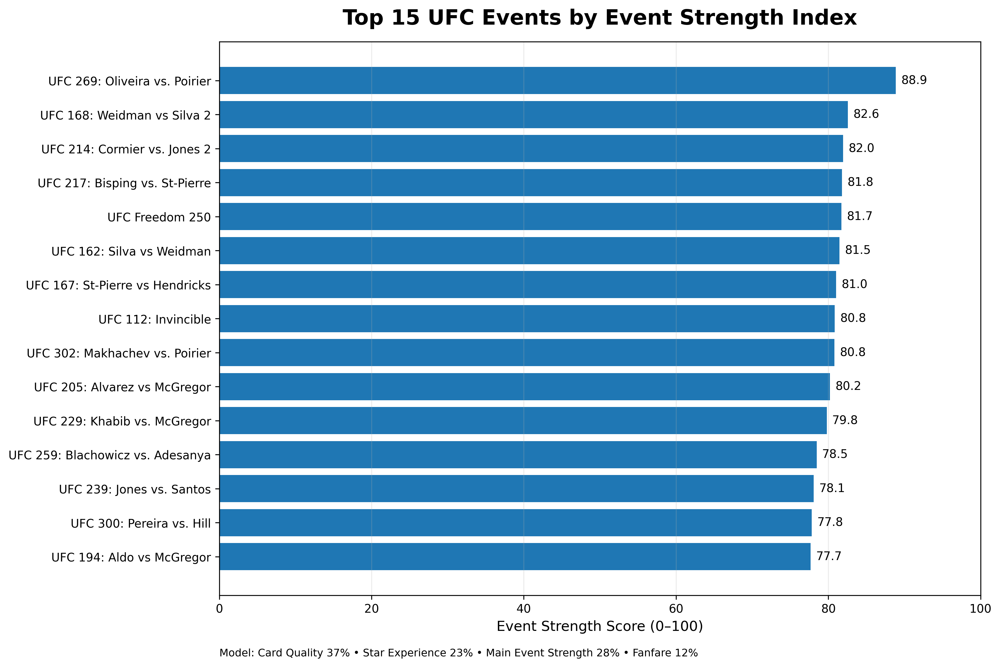
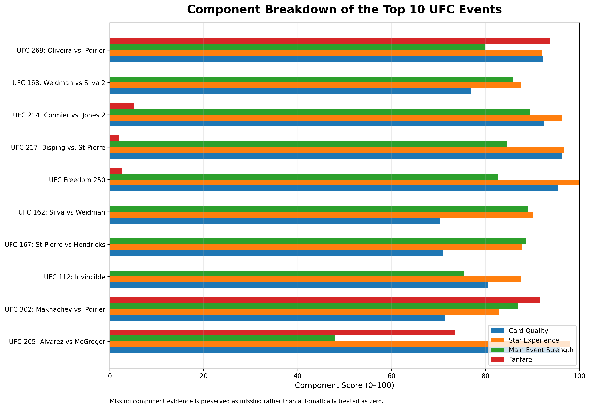
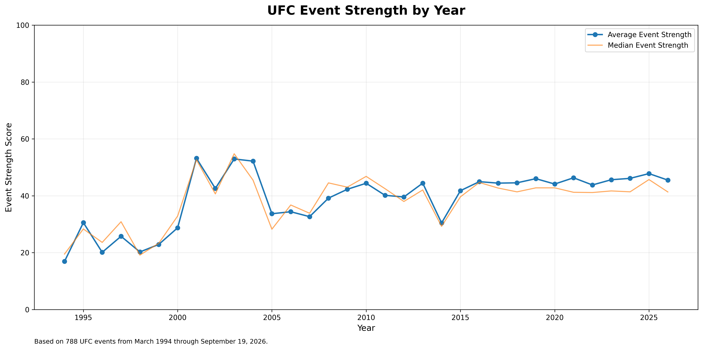

# UFC Event Strength Index

## Which UFC events were the strongest on paper?

The **UFC Event Strength Index** is a Python-based sports analytics project designed to quantify and rank the strength of UFC events using historical fighter performance, rankings, experience, accomplishments, main-event quality, and fan interest.

The current model analyzes **8,877 UFC fights across 788 events**, covering UFC history from **March 1994 through September 19, 2026**.

Each event receives an **Event Strength Score from 0 to 100**.

---

## Final Model

The Event Strength Index combines four major components:

| Component | Weight |
|---|---:|
| Card Quality | 37% |
| Main Event Strength | 28% |
| Star Experience | 23% |
| Fanfare | 12% |

Missing data is **not treated as zero**. When a component is genuinely unavailable, the model dynamically redistributes the available component weights.

### Top 10 Event Component Breakdown

---

## 1. Card Quality — 37%

Card Quality measures the overall competitive strength and depth of the event.

Inputs include:

- Number of title fights
- Ranking strength
- UFC experience
- UFC winning percentage
- Entering-fight win streaks
- Finishing ability

Ranked fighters receive more value based on their ranking position, with champions receiving the highest ranking value.

---

## 2. Main Event Strength — 28%

Main Event Strength evaluates the experience, accomplishments, form, and ranking strength of the two headliners.

Inputs include:

- Combined UFC experience
- UFC winning percentage
- Entering-fight win streaks
- Previous title fights
- Previous UFC main events
- Previous performance bonuses
- Ranking strength

Main events are explicitly verified rather than inferred from fight ordering.

---

## 3. Star Experience — 23%

Star Experience measures how accomplished and established the fighters on the card were entering the event.

Inputs include:

- Previous UFC title fights
- Previous UFC main events
- Previous UFC performance bonuses

This helps distinguish cards featuring established championship-level or high-profile UFC talent.

---

## 4. Fanfare — 12%

Fanfare measures available evidence of public and commercial interest surrounding an event.

The framework incorporates:

- Commercial and audience demand
- Historical drawing power of the headliners
- Pre-event Google search acceleration
- Event gate information when available
- Reported PPV information when available

Search acceleration is limited to its intended contribution so that a large relative Google Trends spike cannot independently create an unrealistically high Fanfare score.

Because historical commercial and search data are incomplete, missing Fanfare evidence is never automatically interpreted as low fan interest.

---

## Preventing Future Data Leakage

A major goal of the project is to evaluate fighters based on what was known **entering each event**.

Historical fighter variables are calculated chronologically using only previous UFC fights.

Examples include:

- UFC record entering the fight
- UFC experience entering the fight
- Win streak entering the fight
- Previous title fights
- Previous main events
- Previous bonuses
- Recent UFC form
- Historical finishing rate

This prevents a fighter's future accomplishments from influencing the score of an earlier UFC event.

---

## Data Sources

The project combines information from several sources, including:

- UFC fight and event results
- UFC.com
- Historical UFC rankings data
- Historical performance-bonus data
- Google Trends
- Reported event gate and PPV/audience information

Some historical data categories have incomplete coverage. Missing observations are preserved as missing rather than automatically converted to zero.

---

## Project Scale

**788 UFC events**

**8,877 UFC fights**

Coverage:

**March 11, 1994 — September 19, 2026**

The current validated version intentionally stops at September 19, 2026.

### UFC Event Strength Over Time

---

## Current Top 10 Events

| Rank | Event | Event Strength Score |
|---:|---|---:|
| 1 | UFC 269: Oliveira vs. Poirier | 88.88 |
| 2 | UFC 168: Weidman vs. Silva 2 | 82.56 |
| 3 | UFC 214: Cormier vs. Jones 2 | 81.96 |
| 4 | UFC 217: Bisping vs. St-Pierre | 81.80 |
| 5 | UFC Freedom 250 | 81.73 |
| 6 | UFC 162: Silva vs. Weidman | 81.47 |
| 7 | UFC 167: St-Pierre vs. Hendricks | 81.03 |
| 8 | UFC 112: Invincible | 80.82 |
| 9 | UFC 302: Makhachev vs. Poirier | 80.79 |
| 10 | UFC 205: Alvarez vs. McGregor | 80.22 |

Rankings reflect the current model and can change as additional historical data or future UFC events are incorporated.

---

## Repository Contents

### `UFC_Event_Strength_Index.ipynb`

The primary Python notebook containing the data processing, feature engineering, validation, and Event Strength scoring workflow.

### `data/UFC_EVENT_STRENGTH_INDEX_2026-09-19.csv`

The primary event-level output containing the final UFC Event Strength rankings and component scores.

### `data/UFC_EVENT_STRENGTH_METHODOLOGY_2026-09-19.csv`

A compact reference documenting model weights, data handling rules, coverage, and methodological limitations.

### `data/UFC_EVENT_STRENGTH_METADATA_2026-09-19.json`

Metadata describing the current validated version of the project.

### `visuals/`

Visualizations created from the Event Strength Index.

---

## Tools Used

- Python
- pandas
- NumPy
- Google Colab
- Google Trends
- GitHub

---

## Project Goal

The goal of this project is to turn the subjective question:

**"How strong was this UFC card?"**

into a reproducible data analytics problem.

Rather than relying only on name recognition or personal opinion, the Event Strength Index combines fighter quality, accomplishments, main-event strength, rankings, historical performance, and measurable fan interest into a single quantitative framework.

The project is designed to continue evolving as new UFC events occur and better historical data becomes available.
